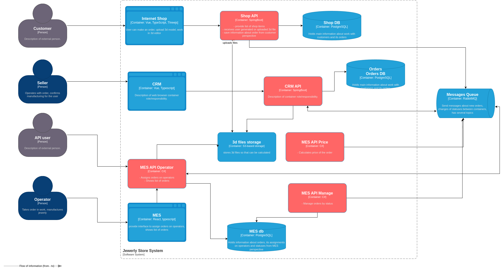

# Архитектурное решение по трейсингу

## Схема приложения

## Мотивация

Внедрение трейсинга по пути всего жизненного цикла заказа даст исчерпывающую информацию о задействованных частях системы. Это позволит получить преимущество в следующих аспектах:

* будем иметь возможность наиболее оперативно локализовать ошибку, приведшую к проблеме с заказом, и исправить ее
* сможем отслеживать "узкое горлышко" системы, что благотворно скажется на производительности
* с помощью трассировок можно будет зафиксировать момент, когда заказ не дошел до определенного этапа и сразу вмешаться, что позволит минимизировать недовольство клиентов

## Предполагаемое решение

Предполагается реализовать трассировки при помощи OpenTelemetry и Jaeger для отслеживания и анализа. Схема системы предложена выше. Данная схема подразумевает, что уже было проведено разбиение MES на несколько микросервисов. Если же рассматривать исходный вариант, то требования остаются те же, основная задача - иметь возможность отслеживать жизненный цикл заказа, как минимум от создания и до взятия в работу.

## Компромиссы

Компромиссы вытекают из текста выше. Если мы не сможем отследить, куда пропадают заказы за счет анализа логов и мониторинга, то внедрение трассировок необходимо будет проводить до разбиения MES. Это может в дальнейшем усложнить процесс перевода на микросервисную Event-Driven архитектуру из-за необходимости перерабатывать логику трассировок в MES

## Безопасность

Jaeger для сбора информации о трассировках будет находиться во внутренней сети и доступ к нему будут иметь только сотрудники через корпоративный VPN или прокси. Также будет дополнительная аутентификация встроенная в Jaeger